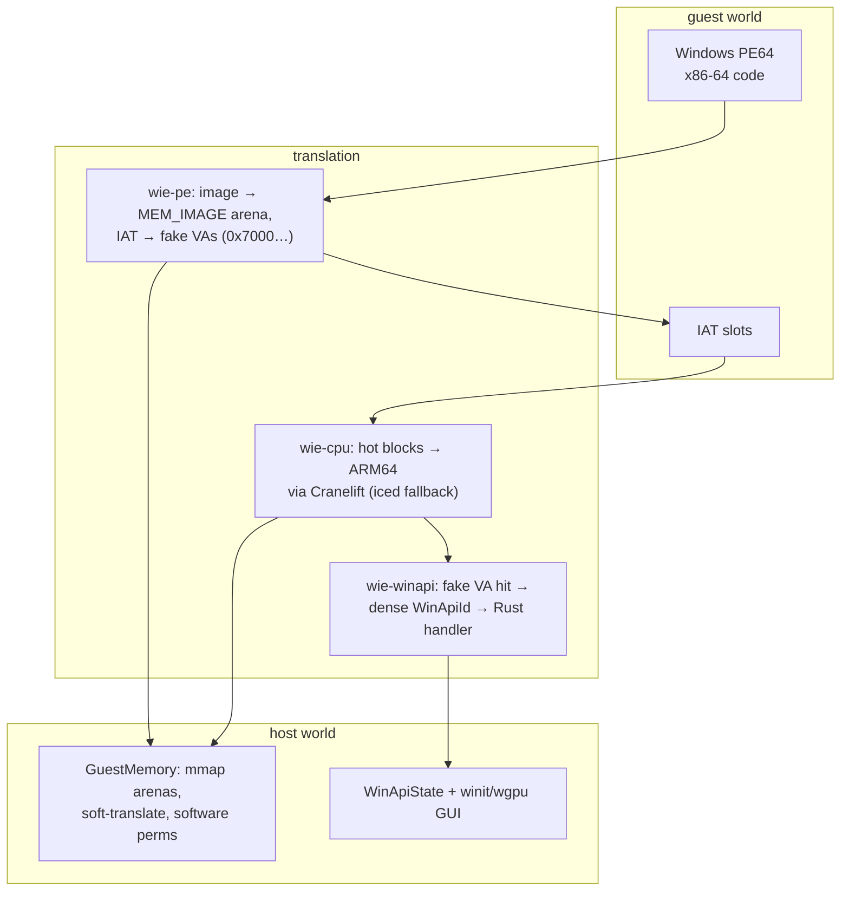
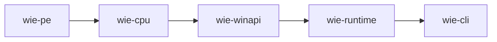

# WIE — run 64-bit Windows apps on Apple Silicon

[](https://github.com/wie-project/wie)
[](LICENSE)
[](https://www.rust-lang.org/)

**WIE (_Wie Is Emulator_) runs Windows PE64 user-mode binaries on macOS Apple Silicon — no Windows, no Wine, no VM.** Guest x86-64 code executes through a Cranelift block JIT; Windows API calls are intercepted and handled on the host in Rust. GUI apps get real macOS windows and native dialogs; a guest's files are real files on your Mac.

> **Experimental research engine.** Classic GUI apps run today (real Windows Notepad: menus, Find/Replace, Go To, Time/Date, printing); the D3D9 software renderer covers VS 2.0 + PS 2.0 with flow control. 32-bit binaries and full Windows compatibility are out of scope — modern GPU-accelerated apps are the long-run target.

## Quick start

```bash
# Build from source
cargo build -p wie-cli --release

# Or install the prebuilt binary with Homebrew
brew tap wie-project/wie
brew install wie

# A Windows console app
./target/release/wie run micro-exes/out/crt_hello.exe

# A Windows GUI app — a real window opens on your Mac
./target/release/wie run --gui micro-exes/out/gui_demo.exe

# A terminal game
./target/release/wie run --console micro-exes/out/snake.exe

# The flagship demo: real Windows Notepad (fetch once)
./scripts/fetch.sh notepad
./target/release/wie run --gui real_exes/notepad.exe
```

File operations just work — no setup. Guest `C:\` maps to a per-user app-data bottle (`~/Library/Application Support/WIE/bottle/`), created on demand; `--root` overrides it. Files you pick in the native Open/Save panels are read and written **in place** on your Mac.

See [What works today](docs/status.md) for the full capability matrix, performance numbers, and the roadmap.

## How it works



Three translations carry the design: the PE becomes guest memory with every import rewritten to a fake VA; hot x86-64 blocks lower to ARM64 (cold/complex code steps through iced-x86); hitting a fake VA returns to the runtime, which decodes the dense API id and runs a Rust handler. Guest addresses are **never** host addresses — every access soft-translates through region tables and software permission checks.

## Crates



| Crate | Role |
| --- | --- |
| `wie-pe` | PE64 parse + resource parsing (dialogs, menus, strings) |
| `wie-cpu` | Cranelift block JIT + iced interpreter; guest memory (mmap arenas, TLB, software perms) |
| `wie-winapi` | Windows API handlers (KERNEL32/USER32/GDI32/D3D9/comdlg32), guest heap, bottle VFS, SEH |
| `wie-runtime` | `RuntimeSession`: PE load, fake-API hooks, guest stubs, the run loop, threading |
| `wie-cli` | `inspect` / `run` / `trace`; the winit/wgpu GUI host, native dialogs |

## Docs

| Doc | Topic |
| --- | --- |
| [Status](docs/status.md) | Capability matrix, performance, roadmap |
| [Architecture](docs/architecture/) | Crate-by-crate deep dive (pe, cpu & memory, winapi, GUI, D3D9, runtime) |
| [Runbook](docs/RUNBOOK.md) | Debugging playbook + all environment knobs |
| [Missing handlers](docs/missing-winapi-handlers.md) | WinAPI surface gaps |
| [Real-app runbooks](docs/7zip.md) | 7-Zip, 2048, Snake workflows |

## Contributing

See [CONTRIBUTING.md](CONTRIBUTING.md). The pre-PR gate is `./scripts/check.sh`.

## License

**GNU Lesser General Public License v3.0 (LGPL-3.0)** — see [LICENSE.txt](LICENSE.txt).
