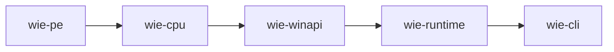

# Architecture

**WIE** runs 64-bit Windows user-mode binaries on Apple Silicon macOS. This directory provides a crate-by-crate deep dive into the system design.

## Docs

| Doc | Topic |
| --- | --- |
| [PE Loading](pe-loading.md) | PE64 parsing, resource extraction, IAT fake virtual addresses |
| [CPU & Memory](cpu-and-memory.md) | Cranelift JIT, memory mapping, TLB, software permissions |
| [WinAPI Handling](winapi-handling.md) | API handlers, guest heap, bottle VFS, SEH emulation |
| [GUI](gui.md) | winit/wgpu host, native dialogs, window procedure forwarding |
| [D3D9](d3d9.md) | Software renderer, shader pipeline, state tracking |
| [Runtime](runtime.md) | RuntimeSession, PE loading, API hooks, run loop, threading |
| [C++ Exceptions](cpp-exceptions.md) | Exception handling across the translation boundary |

## Design Overview

Three translation layers carry the design:

1. **PE → Memory** (`pe-loading.md`): Windows PE64 is parsed into a `MEM_IMAGE` arena; every import is rewritten to a fake VA in the `0x7000…` range.
2. **CPU** (`cpu-and-memory.md`): Hot x86-64 blocks lower to ARM64 via Cranelift (complex/cold code falls through an iced-x86 interpreter).
3. **WinAPI** (`winapi-handling.md`): Hitting a fake VA returns to the runtime, which decodes the dense API ID and dispatches to a Rust handler.

Guest addresses are **never** host addresses — every access soft-translates through region tables and software permission checks.

## Crates

| Crate | Role |
| --- | --- |
| `wie-pe` | PE64 parse + resource parsing (dialogs, menus, strings) |
| `wie-cpu` | Cranelift block JIT + iced interpreter; guest memory (mmap arenas, TLB, software perms) |
| `wie-winapi` | Windows API handlers (KERNEL32/USER32/GDI32/D3D9/comdlg32), guest heap, bottle VFS, SEH |
| `wie-runtime` | `RuntimeSession`: PE load, fake-API hooks, guest stubs, the run loop, threading |
| `wie-cli` | `inspect` / `run` / `trace`; the winit/wgpu GUI host, native dialogs |