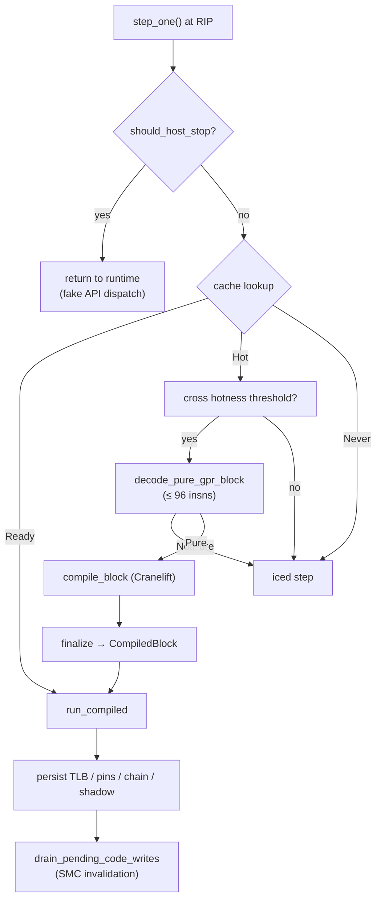
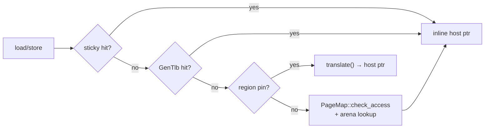

# The CPU backends and guest memory (`wie-cpu`)

`wie-cpu` is the execution engine. Two backends implement one `CpuEngine` trait: `JitCpu` (a Cranelift block JIT — the default) and `IcedCpu` (a pure iced-x86 interpreter — the `WIE_CPU=iced` oracle). Both execute against the same `GuestMemory`, which is the only memory model in the project.

## Two backends, one trait

```mermaid
flowchart TD
    subgraph CpuEngine trait
        M["mem_map / mem_read / mem_write / host_span"]
        R["run_until_stop(rip, budget, fake-va window)"]
        W["return_from_win64_api(rax)"]
        T["snapshot/restore_thread_context"]
    end

    JitCpu --> CpuEngine trait
    IcedCpu --> CpuEngine trait
    JitCpu --> J["Cranelift block JIT<br/>compile hot blocks → ARM64"]
    IcedCpu --> I["iced-x86 step interpreter"]
    JitCpu --> S["Arc&lt;JitShared&gt;<br/>shared compile cache + memory"]
    J -->|"fallback"| I
    CpuEngine trait --> G["GuestMemory<br/>mmap arenas + RegionTable + PageMap + VAD"]
```

- **`JitCpu`** compiles hot, *pure* basic blocks (GPR/memory/ALU/SSE/REP-string instructions) to ARM64 and executes them natively. Anything else — cold code, complex instructions, API stops — falls back to iced stepping.
- **`IcedCpu`** decodes and executes one instruction at a time; it shares `GuestMemory` behind `Arc<RwLock<…>>` across threads. Its job is correctness: every JIT fast path has an iced counterpart to bisect against.

## The JIT

### Compile pipeline



Key design points:

- **Hotness threshold.** A block must be visited a few times before it earns compilation; self-loops and UCRT fast-API calls compile eagerly. Cold one-shot code never pays the compile tax.
- **Chaining.** Compiled blocks `call` their known successors directly (late-bound via `wie_jit_chain_lookup` when unknown). A shadow return stack validates `ret` targets; mispredicted returns zero the shadow state and fall back to the dispatcher. Chain depth is capped (`MAX_CHAIN_DEPTH = 48`) to protect the host stack.
- **The super path.** Stack-heavy self-loops can get a block-wide guard: one prologue check, then *bare host pointer arithmetic* (region-pin slot 0) for the loop body — the biggest single speedup for pure compute.
- **Trampolines.** 1–3 instruction micro-stubs (`ret`, `xor eax,eax; ret`, `GetLastError` reading the TEB slot, …) skip Cranelift entirely.
- **SMC correctness.** Guest stores to code pages are recorded; after each block run, any `Ready` block overlapping a written page is dropped (`drain_pending_code_writes`).
- **SIMD.** SSE2 lowers to ARM64 NEON via Cranelift's ISLE rules by default (`WIE_JIT_SIMD=1`); `WIE_JIT_SIMD=0` calls scalar `wie_sse_*` Rust helpers. Tests dual-execute every SSE2 op on JIT and iced and assert identical state.

## Software translation and the TLB

Guest memory is **soft-translated**: `host = arena_host_base + (guest_va - guest_base)` is computed in exactly one place (`MemPin::translate`), with `GuestVa`/`HostAddr` distinct types. The access hierarchy inside a compiled block:

1. **Sticky page** — the last-hit single guest page (2-way sticky), the common sequential case.
2. **`GenTlb`** — a 64-entry set-associative software TLB, generation-stamped.
3. **Region pins** — 8 slots ranked by size (slot 0 = stack, slot 1 = primary heap); `translate()` enforces containment before any pointer arithmetic.
4. **PageMap slow path** — the software permission oracle (`check_access`, all-or-nothing over the access span).



One `mem_gen` counter bump on any map/protect/free invalidates the whole TLB — no per-entry removal.

## Memory model

| Component | Role |
| --- | --- |
| `MmapArena` / `ArenaSet` | One contiguous `mmap` region per arena; sorted set with binary search by guest VA |
| `RegionTable` | Named guest regions (image, heap, stack, fake-API window, …) with perms |
| `PageMap` | Sparse run-length page states + packed hot-run cache — the software permission oracle |
| `VadTable` | `VirtualAlloc` bookkeeping; free-region search upward from 4 GiB |
| `generation` | Bumped on every structural mutation — invalidates TLB/pins/compiled-cache staleness |

Two protection encodings exist on purpose: `RwxPerms` (rwx bits) and `PageProtect` (Windows `PAGE_*`). They collide numerically (`PAGE_READWRITE == 4 == EXEC`), so the type split makes silent misuse a compile error.

**The 4K/16K page relationship** is why host `mprotect` is never the oracle: guests use 4 KiB pages, Darwin host pages are 16 KiB, and a mapped guest page sits inside a wider host page. Software checks (`PageMap`) are the correctness plane; `mprotect` is an optional supplement (`WIE_MPROTECT`), applied only when ranges align to host granularity.

## Invariants and gotchas

- **`unsafe` confinement**: workspace-wide `unsafe_code = deny`, except `wie-cpu/src/jit` and `mem/arena.rs` — the JIT entry helpers and mmap wrappers are the only legitimate uses.
- **`return_from_win64_api` clears the shadow stack** — the shadow contract only holds within a chain of compiled blocks; crossing into a host API handler and back breaks it, so it resets.
- **`host_span(write)` denies executable spans** — JIT code pages never get a direct writable host pointer; SMC invalidation never depends on a returned slice.
- **Background-compiled blocks are validated at install** — if `mem_gen` moved or a code page was written while the worker compiled, the result is dropped.
- **`exec::step` stubs**: `Cpuid` returns 0, `Rdtsc` reads host monotonic time — honest minimal answers, documented per instruction.
