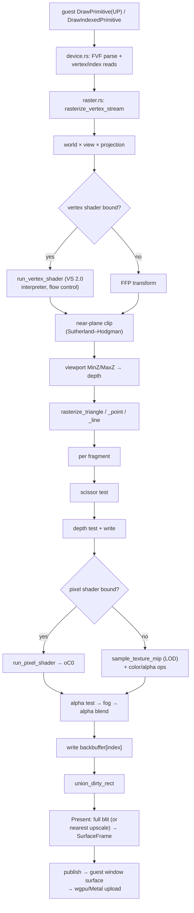

# The D3D9 software renderer

D3D9 support is a **software renderer that runs on the host CPU, always** — there is no GPU path yet. Every `DrawPrimitive*` synchronously rasterizes into a host-owned backbuffer; `Present` publishes it into the guest window surface, which the wgpu/Metal presenter uploads. The long-run plan is offloading rasterization to Metal compute with this renderer as the correctness oracle.

## Layers

| Layer | Files | Role |
| --- | --- | --- |
| COM surface | `d3d9/mod.rs` | `Direct3DCreate9`, `IDirect3D9` vtable, `CreateDevice`, caps honesty (programmable pipeline version reported as 0 → games take the fixed-function path), `WIE_D3D9_SCALE` |
| Device | `d3d9/device.rs` | Every `IDirect3DDevice9` method: render state, scene markers, transforms/viewport, `Present`/`Clear`, all Draw forms, buffers, scissor |
| Resources | `d3d9/{texture,buffer,shader,raster,blend}.rs` | Textures (full mip chains), vertex/index buffers, shader objects (tokenized at create), draw helpers, depth/blend surface APIs |
| Shader front-end | `d3d9_shader.rs` | vs_2_0 / ps_2_x tokenizer: `parse_shader` → `ParsedShader`; `def`/`defb`/`defi` constants extracted at create time |
| Renderer | `d3d9_render/{mod,vs,ps,flow,raster,sample,blend,vertex}.rs` | FVF decoding, transforms, clipping, the VS/PS interpreters, rasterization, sampling, blending |
| State | `state/d3d9.rs` | `D3D9State`: scene state, matrices, `d3d9_dirty: Option<IRect>` accumulator, host-owned 0RGB backbuffer |

## The draw pipeline



## The shader model

- **Tokenizer** decodes vs_2_0/ps_2_x tokens without a length field — operand counts come from a per-opcode table (matching Wine's `shader_get_next_instruction`). Quirks are documented in the code: `texld` is opcode 66 (`D3DSIO_TEX`), `D3DSPR_SAMPLER` is 10, relative addressing rides bit 13, predication bit 28.
- **VS 2.0 interpreter** (`d3d9_render/vs.rs`): full arithmetic core including matrix ops (`m4x4`…), `dst/lit/pow/crs/sgn/nrm/sincos/dp2add/mova`, flow control, relative `c[a0.x+n]` reads.
- **PS 2.0 interpreter** (`d3d9_render/ps.rs`): arithmetic core + `tex/texldp/texldb/texkill`, flow control, predication, `oDepth` stored-but-not-applied, step budget `MAX_SHADER_STEPS`.
- **Flow control** (`d3d9_render/flow.rs`): one-pass jump-target precomputation (`FlowMap`), a call stack capped at 32, loop/rep block stacks.
- `def`/`defb`/`defi` are **compile-time only**: they seed the device constant registers at `Create*Shader` and produce no executed instructions.

## Memory and the backbuffer

- The backbuffer is a host-owned `Vec<u32>` (0RGB), never guest memory. The guest's surface handles point at host structures.
- `LockRect` hands the guest a **host-allocated coherent block** (guest heap `alloc_coherent`) — the guest fills it with normal writes, `UnlockRect` copies back into the host texel buffer. Soft-translate holds even for texture data.
- `WIE_D3D9_SCALE=2|4|8` divides the render resolution by a power of two; the guest still believes it rendered full-size, and `Present` nearest-upscales. Scale 4 = 1/16 the fragments.

## The resting-frame hash tripwire

`D3D9_RESTING_FRAME_HASH` (in `micro_gui_window/helpers.rs`) is a CI-gated FNV-1a 64 hash of the `gui_d3d9.exe` demo's deterministic resting frame. It gates two NEON fast paths in the rasterizer (`blend_0rgb_4x`, `fill_0rgb_4x` — byte-identical to the scalar paths, proven by the gate). **Any change to the fragment pipeline (blend, fog, alpha test, scissor, NEON paths) must recompute the hash** before merging:

```bash
./target/debug/wie run --screenshot /tmp/d.bmp micro-exes/out/gui_d3d9.exe
# then FNV-1a 64 over the 0RGB pixel bytes
```

## Honesty bar

- Out-of-range render-state values return `D3DERR_INVALIDCALL` — unsupported blend factors/compare functions are **rejected, never silently misrendered**.
- Caps are honest: unimplemented pipeline stages report 0 so guests choose a modelled path.
- The device API surface is still small (~5–7% of `IDirect3DDevice9`); `Present` always blits the full backbuffer (the `d3d9_dirty` accumulator is reserved for a future partial-present optimization).
