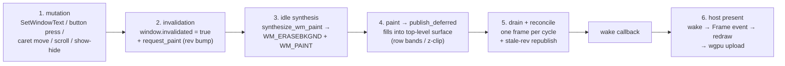

# The GUI subsystem

WIE's GUI is a two-world system. **Guest-side** (`wie-winapi`/user32 + gdi32 + comdlg32): windows, controls, messages, and dialogs are modelled as real host objects, painted into a shared top-level framebuffer. **Host-side** (`wie-cli`/gui): winit windows, a wgpu (Metal) presenter, the macOS menu bar (muda), and native dialogs (rfd). The two worlds meet at the **presentation pipeline** — a pull-based repaint system built around content revisions.

## The window and control model

`WindowRecord` is the single model: handle, parent, style, `visible`, `invalidated`, `control_kind`, `window_proc`/`dialog_proc`, client rect, text, flags.

- **`control_kind`** marks built-in controls (BUTTON `0x80`, STATIC `0x82`, EDIT `0x81`, LISTBOX `0x83`, COMBOBOX `0x85`). Plain windows — dialogs, top-levels — have `None` and are routed through their window/dialog proc instead of `dispatch_control_proc`.
- **Invalidation seeding**: built-in controls start `invalidated = true` (their first empty `GetMessage` synthesizes a WM_PAINT); dialogs and top-levels start clean and must be invalidated explicitly. A modeless dialog that never gets an `InvalidateRect` never paints — by design.
- **Control state** is per-kind: `EditState` (caret, selection, `first_visible_line`, `invalid_rows` band, undo buffer), `LabelInvalidation` (`Full` | narrow rect | `Clean`), etc.

## The presentation pipeline

Five seams connect a guest mutation to pixels on your screen:



**Seam 1–2 — mutation → invalidation.** Every visible-state mutation calls `invalidate_control_rect` / `edit_invalidate_rows` / `edit_invalidate_full`, which sets the window's flag **and** bumps the top-level's content revision via `request_paint`. The two are separate seams: plain `invalidate` (lowercase) only sets the flag — the revision bump is what makes the pull-based republish fire.

**Seam 3 — idle synthesis.** At the `WaitingForMessage` boundary, `synthesize_wm_paint` picks the first invalidated window and queues its erase + paint. Erasing fills the class brush clipped around visible children (WS_CLIPCHILDREN decomposition) and calls `reset_edit_bands_in_subtree` — a full erase forces every EDIT in the subtree to a full repaint, because a band-limited repaint after an erase would leave blank rows.

**Seam 4 — paint.** `paint_control` dispatches per kind. Notable details:

- STATIC's face fill lives in the shared `paint_control` arm, not in `paint_label` (which only renders text).
- EDIT paints only its dirty **row band** (`EditInvalidation::Band`); structural changes (crossed-line mutations) reset to `Full`.
- All fills are **z-order clipped** (`above_window_rects`): a z-lower sibling painting full-width bands can't wipe a window composited above it (the find-dialog white-background bug was exactly this).
- Hidden windows are gated at `paint_control` (visibility check) — the synthesizer queues them, the gate skips them.
- Every paint calls `publish_deferred` for the top-level ancestor.

**Seam 5 — drain + reconcile.** `drain_pending_publishes` publishes each deduplicated top-level once per idle boundary (one frame per repaint cycle, union dirty region). `reconcile_and_publish` then diffs `content_rev` vs `last_published_rev` and republishes stale top-levels — the pull half that guarantees a mutation-bumped window reaches the screen even if no paint deferred a publish.

**Seam 6 — host present.** The publish fires a stored wake callback → `WieEvent::Frame` in the winit loop → `request_redraw` → `take_frame` reads the current published slot → wgpu uploads (dirty region when hinted; full frame on generation gaps). A budget-exhausted `NotDrawn` present schedules a throttled re-arm so a single-wake flow can't strand its frame. Wave3 defaults: per-HWND pooled `WindowSurface` (64 px padding → `row_bytes %256==0` zero-copy full-frame `write_texture`), host-reused `Vec<u8>` scratch for region uploads, and latest-wins coalescing (`pending_publishes` deduplicated per cycle + `retry_delay` throttling) — all default on, no env required; steady zero-alloc confirmed via `WIE_RUNTIME_PROFILE=1` `hand_back_unwrap` vs `clone` counters.

```mermaid
sequenceDiagram
    participant G as guest (mutation)
    participant W as window model
    participant S as synthesizer
    participant P as PresentState
    participant A as app loop (winit)
    participant WG as wgpu presenter

    G->>W: mutation (e.g. SetWindowText)
    W->>W: invalidated = true; request_paint → rev++
    W->>P: wake callback
    P-->>A: WieEvent::Frame
    A->>WG: request_redraw
    Note over S,P: idle boundary
    S->>S: synthesize_wm_paint (first invalidated, visible-gated)
    S->>W: WM_PAINT → paint_control → publish_deferred
    P->>P: drain_pending_publishes (one frame)
    P->>P: reconcile_and_publish (stale revs)
    WG-->>WG: take_frame → present (current slot)
```

## The repaint latch

`ContentRev` is a monotonic fingerprint per top-level. `request_paint(state, hwnd)` resolves the **top-level ancestor** of `hwnd` and bumps *its* revision — a button click inside a dialog bumps the owner's rev, not the button's, because controls composite into the top-level surface. `reconcile_and_publish` republishes any top-level whose rev advanced past its last published rev. The latch is belt-and-braces: most paint paths already defer publishes that the drain covers; the latch guarantees the mutation-only path (no paint) still reaches the screen.

## Dialogs

`CreateDialogParamA/W` resolves the template (`resolve_template` → `wie-pe`'s `DLGTEMPLATEEX` walker), builds the dialog window + children, and seeds the subtree invalidated. `paint_dialog` fills `DIALOG_BG` (0xF0F0F0) clipped around direct children and strokes a 1 px border. `EndDialog` writes the result to a guest memory slot, posts `WM_QUIT` (the in-guest `DialogBoxParam` stub loop reads the slot), removes the subtree, and invalidates the owner with `ERASE_BACKGROUND` so the next cycle erases the dialog region.

The **modeless Find/Replace dialog** is entirely host-side (`comdlg32/find.rs`): a "FindDialog" window with no guest dialog proc, `is_find_dialog_window` routing its WM_PAINT to `paint_dialog`, and button commands handled in Rust (posting FINDMSGSTRING to the guest).

## Native bridges

- **rfd** (Open/Save/MessageBox): bridged via `ParentWindowSlots` — a shared map the guest thread fills before the winit window exists, the host loop completes. The guest thread blocks in the bridge; the result returns synchronously. No async machinery.
- **muda**: the guest menu tree mirrors into the macOS menu bar; menu events decode back to guest item ids and post `WM_COMMAND`.
- **Font/Print/Page Setup**: native panels via the same slot bridge, feeding the font/print state handlers.

## Host stack roles

| Component | Role |
| --- | --- |
| **winit** | Event loop + windows; input → guest messages |
| **wgpu (Metal)** | Present: `Bgra8Unorm` staging (guest 0RGB LE bytes land correctly), fullscreen-triangle blit forcing alpha = 1.0, dirty-region uploads |
| **muda** | macOS menu bar mirror |
| **rfd** | Native Open/Save/MessageBox panels |

## Gotchas

- The `background_color` invariant: surfaces carry their class-brush color so resize seams read as the brush, never black; unpainted frames fall back to white (`COLOR_WINDOW`).
- `Arc::try_unwrap` zero-copy hand-back can fail even at refcount 1 (the host's keep-alive holds the Arc) — the clone fallback is a 4 MB memcpy under the WinAPI mutex.
- `resolve_window_ancestor` walks to the first NULL-or-self parent — a partially unregistered parent chain resolves early, which is correct for the legacy fake window but can surprise.
- `paint_label` never fills its own face; `static.rs` is text-only.
