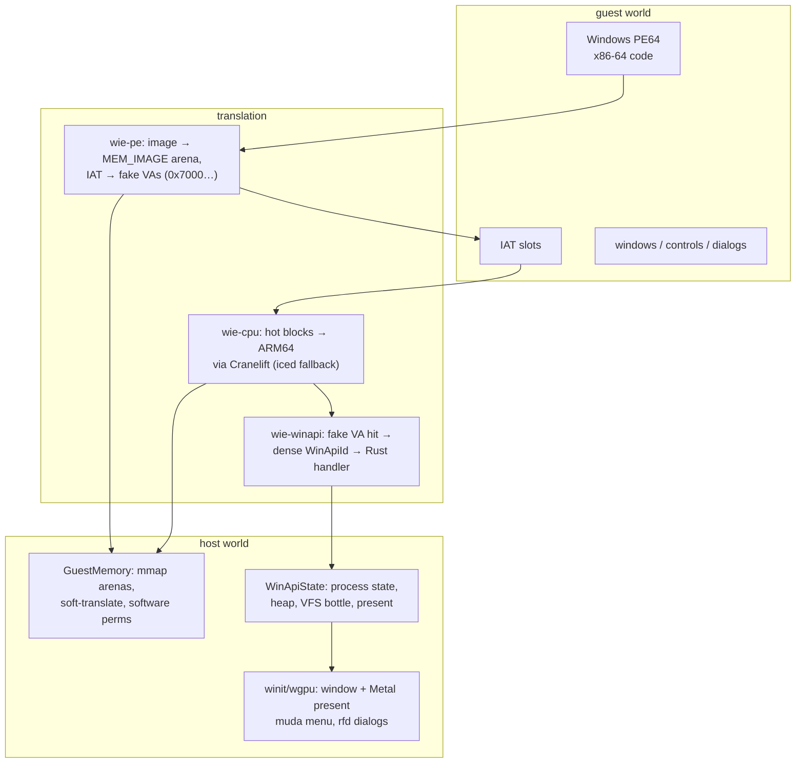
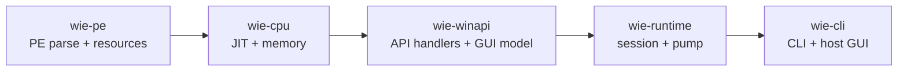
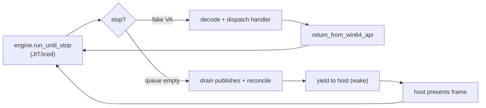

# WIE architecture overview

WIE (_Wie Is Emulator_) runs Windows PE64 user-mode binaries on macOS Apple Silicon. Guest x86-64 code executes through a Cranelift block JIT; Windows API calls are intercepted and handled on the host in Rust; GUI windows and dialogs are real macOS objects. Everything hangs on one rule: **guest virtual addresses are never host addresses**.

## The three translations

1. **The PE becomes guest memory** (`wie-pe`): headers and sections land in a `MEM_IMAGE` arena, every import slot is rewritten to a dense fake VA in the `0x7000_0000_0000_xxxx` window, and protections are derived from COFF flags.
2. **Guest code runs through a JIT** (`wie-cpu`): hot, pure basic blocks lower to ARM64; everything else steps through iced-x86. Memory is soft-translated through region tables, a software TLB, and page-permission checks — never `mmap(addr = guest_va)`.
3. **API calls are host calls** (`wie-winapi`): hitting a fake VA stops the CPU; the runtime decodes the ID (O(1), no string compare) and runs a Rust handler that returns via the Win64 ABI.

## Crates

Five crates, linear dependency flow:

| Crate | Doc |
| --- | --- |
| `wie-pe` | [pe-loading.md](pe-loading.md) |
| `wie-cpu` | [cpu-and-memory.md](cpu-and-memory.md) |
| `wie-winapi` | [winapi-handling.md](winapi-handling.md) · [gui.md](gui.md) · [d3d9.md](d3d9.md) |
| `wie-runtime` | [runtime.md](runtime.md) |
| `wie-cli` | [gui.md](gui.md) (host side) |

## The runtime loop

`RuntimeSession` alternates guest execution with API dispatch. Each quantum: run until a fake-VA stop or budget exhaustion → decode → dispatch (or complete a bridged callback) → resume. When the guest's message queue is empty (`WaitingForMessage`), the pump drains pending publishes, reconciles stale surfaces, and yields to the host event loop.

## Threading

Guest threads map 1:1 to host threads. Each gets its own CPU engine; JIT threads share only the compiled-code cache. WinAPI state sits behind a shared mutex that parked threads (waiting on events, critical sections) must drop. The GUI loop communicates with the guest through `GuestHandle`: posting locks only the message queue, and a condvar wake replaces polling.

## Where the docs go deeper

- **Soft translation, the JIT, and memory** — [cpu-and-memory.md](cpu-and-memory.md): the block pipeline, the software TLB, generation invalidation, the 4K/16K page rule.
- **Loading a PE** — [pe-loading.md](pe-loading.md): image mapping, the fake import table, protections, resource parsing.
- **API handling** — [winapi-handling.md](winapi-handling.md): dispatch, handler conventions, strings, heap, bottle, SEH.
- **The GUI pipeline** — [gui.md](gui.md): the five seams from mutation to present, the repaint latch, dialogs, native bridges.
- **The D3D9 renderer** — [d3d9.md](d3d9.md): the software rasterizer, shader interpreters, the resting-frame hash.
- **Session and pump** — [runtime.md](runtime.md): init sequence, the run loop, guest stubs, the idle boundary.
