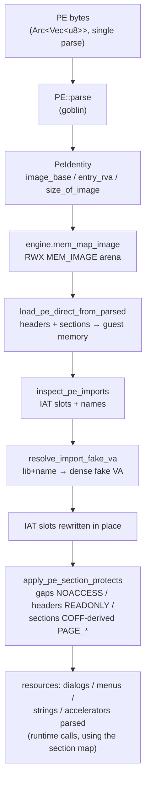

# PE loading (`wie-pe`)

`wie-pe` turns a Windows PE64 file into a **guest memory image**: headers and sections mapped into a `MEM_IMAGE` arena, every import table slot rewritten to a fake API VA, and software page protections derived from the COFF section characteristics. It never executes anything — it prepares the world the CPU backend will run in.

## The load pipeline



Key properties:

- **One parse, shared bytes.** The PE is parsed once; the byte buffer is shared via `Arc` for the lifetime of the session.
- **Direct-to-guest write.** `load_pe_direct` writes sections straight into the already-mapped arena — no intermediate flat image (contrast with `build_loaded_image`, which produces a `Vec<u8>` for hosts that want a copy).
- **RVA → file offset** uses `virtual_size.max(raw_size)` as the section span (`rva_to_file_offset`, `lib.rs:743`) — the Windows-loader behaviour for BSS sections (`raw_size = 0`, committed `virtual_size`).

## The fake import table

Every import slot is rewritten to a VA inside the **4 MiB fake API window**:

```
0x0000_7000_0000_0000 .. 0x0000_7000_0040_0000
```

`resolve_import_fake_va` (`hooks.rs:179`) encodes each import as **kind | payload** with a 16-byte stride (`wie_winapi::fake_va`): APIs the emulator knows become `encode_export(id)`; soft/unresolved entries become `encode_unresolved(index)`. The runtime maintains a **stop bitmap** covering the window (one bit per 16-byte slot) so the CPU backend can detect a fake VA hit cheaply.

> The stop bitmap is load-bearing: a fake VA without its bit set is executed as x86-64 bytes — almost always an illegal instruction, sometimes a silent wrong answer.

## Section protections

`PeMapPlan` carries a `final_protect` per section, derived from the COFF characteristics by `protect_from_section_characteristics` (`lib.rs:348`):

| COFF flags | Resulting protection |
| --- | --- |
| `IMAGE_SCN_MEM_EXECUTE` (+ read) | `PAGE_EXECUTE_READ` |
| `IMAGE_SCN_MEM_READ` / write combinations | matching `PAGE_READONLY` / `PAGE_READWRITE` |
| gap pages between sections | `PAGE_NOACCESS` |
| headers | `PAGE_READONLY` |

Execute-only is never emitted — fetch + read is the minimum, because emulated code needs to read its own constants.

## Resource parsing

The runtime asks `wie-pe` for the guest's resources after loading (`parse_dialogs` / `parse_menus` / `parse_strings` / `parse_accelerators`), using the section map returned by the loader:

| Resource | Parser | Notes |
| --- | --- | --- |
| `RT_DIALOG` | `resources/dialog.rs` | `DLGTEMPLATE` **and** `DLGTEMPLATEEX` walkers (`parse_dialog_template_ex` — 32-bit extended templates are the norm in modern PEs; detection is `word0 == 1 && word1 == 0xFFFF`). DLU → pixel conversion, ordinal class decoding (`0x80` Button / `0x81` Edit / `0x82` Static / `0x83` ListBox / `0x85` ComboBox, plus the PE-spec `0xFFxx` encodings) |
| `RT_MENU` | `resources/menu.rs` | `MENUHEADER` / `MENUITEM` / `MENUEX` |
| `RT_STRING` | `resources/string.rs` | string-table format |
| `RT_ACCELERATOR` | `resources/accel.rs` | accelerator tables |
| `RT_VERSION` | `resources/version.rs` | `VS_VERSIONINFO` / `StringFileInfo` |

The dialog walker is the foundation of the whole dialog story: a dialog that fails to parse falls back to a synthesized empty template — historically, *every* notepad dialog was silently empty because `DLGTEMPLATEEX` was unhandled (`e4f020a`).

## Invariants

- `wie-pe` has **no bottle knowledge** — `process_identity_from_host_path` defaults guest `C:\` to the drive root; path mapping happens in `wie-winapi`.
- The patched image is written **before** protections are applied; the IAT patch writes happen inside `load_pe_direct`.
- All addresses in this crate are guest VAs — nothing is ever dereferenced as a host pointer.
