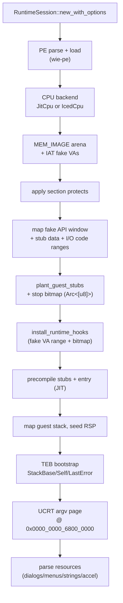
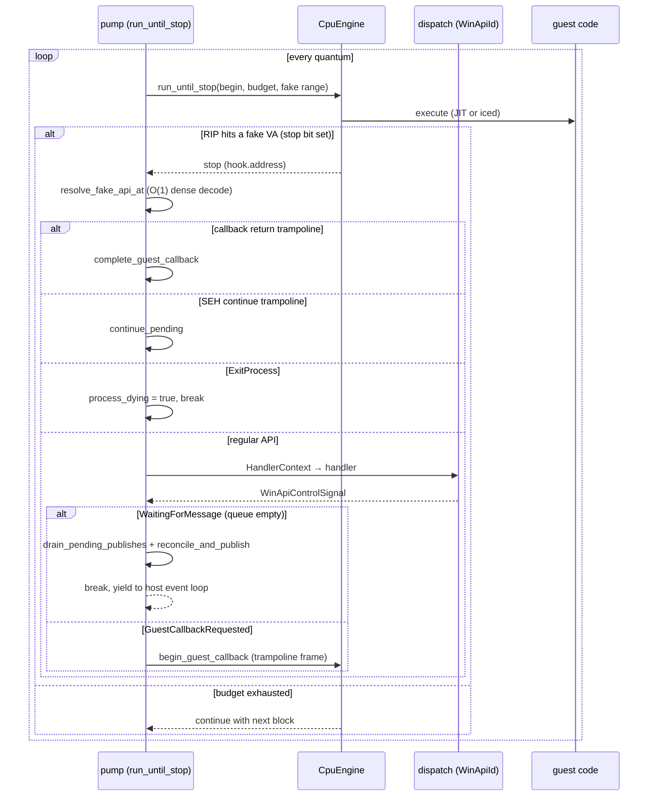

# The runtime session (`wie-runtime`)

`RuntimeSession` owns everything between "the PE is loaded" and "the guest exited": the CPU engine, the WinAPI state, the message queue, the guest stubs, and the pump that turns CPU stops into API calls.

## Session creation

Notable fixed guest ranges (`RuntimeMemoryLayout`, `memory.rs`):

| Region | VA | Purpose |
| --- | --- | --- |
| Fake API window | `0x0000_7000_0000_0000` (4 MiB) | fake import targets + trampolines |
| Guest I/O code | `0x0000_7000_0040_1000` | accelerator code |
| Stub data | `0x0000_7000_0040_9000` | metrics, syscolors, cwd blob |
| Clock table | `0x0000_7000_0040_B000` | host-refreshed 6-slot clock |
| Process heap | `0x0000_0001_6000_0000` (512 MiB) | guest heap |
| CRT argv | `0x0000_0000_6800_0000` | argc/argv/command-line page |
| TEB | `wie_cpu::GS_BASE` | last-error slot etc. |

## The run loop (the pump)

Every API stop pays: decode the fake VA → build a `HandlerContext` → run the handler → `return_from_win64_api`. The hot path stays in guest code via **in-guest stubs** (see below).

## The idle boundary

`WaitingForMessage` fires only when the guest queue is empty — and it runs `drain_pending_publishes()` + `reconcile_and_publish()` before yielding. This is the heartbeat of the GUI: one frame per complete repaint cycle, emitted at a well-defined point. It fires **regardless of callback nesting depth** — a modal dialog's nested `GetMessage` loop runs inside a bridged callback, and skipping the drain there would suppress the dialog's painted frame.

## Guest stubs

Hot APIs never stop the host: the runtime plants x86-64 machine-code bodies into guest memory (`guest_stubs/encode.rs`) that answer directly — `GetLastError` reads a guest slot, `Interlocked*` uses host atomics, clock APIs read the refreshed clock table, and so on. Two deserve a closer look:

- **`DialogBoxParam` runs in-guest.** Its loop calls `GetMessageA` / `IsDialogMessageA` / `DispatchMessageA` — each a fake-VA stop handled by the host — and `EndDialog` writes the result to a **guest memory slot** that the stub reads back when the loop exits.
- **The callback trampoline.** Bridged WndProc calls return to `callback_return_trampoline_va` (`fake_api_base + 0x100`). Hitting it tells the pump to pop the `PendingGuestCallback` stack and return from the outer `DispatchMessageA`.

Stub correctness policy: stubs are planted only when the in-guest body honours the documented API contract — simplified always-success answers that diverge from Microsoft Learn are not used; those APIs stay on the host path.

## Cross-thread handles

`GuestHandle` is the cloneable, cross-thread window into a session: `window_at` (full-hierarchy hit-test), `post_message`, `take_frame`, the wake callback, menu-tree cache. Posting locks **only the message queue**, never the big WinAPI mutex — the guest thread blocks on API state, not on the host posting to it. A waiting guest wakes immediately (condvar + `triggered` atomic), not on a poll tick.

## Invariants and gotchas

- **Stop-bit coverage**: every fake VA must have its stop bit set before `install_runtime_hooks` — a missing bit means the CPU executes garbage.
- **Soft-translate only**: guest VA ≠ host VA everywhere; `mprotect` supplements but never replaces the software oracle.
- **`ExitProcess` is special-cased** in the pump (`pump.rs:421`): it sets `process_dying` and breaks, instead of running a handler. CRT exit paths (`exit`/`_exit`/`abort`) are treated identically via traits.
- **Dynamic imports**: the import resolver is a closure capturing the soft table (`init.rs:964`) — late-bound DLLs grow the soft table at runtime.
- **`.pdata` feeds SEH**: `RtlLookupFunctionEntry` uses the registered `.pdata` table to find unwind info by RIP — without it, hardware faults (divide-by-zero) have no handler to dispatch to.
- **The `CreateDialogParam` 5th-arg slot** lives at `[rsp+0x90]` relative to the caller's entry RSP (stub prologue + caller stack arg) — a one-off stack offset convention, pinned by a unit test (`e4f020a`).
