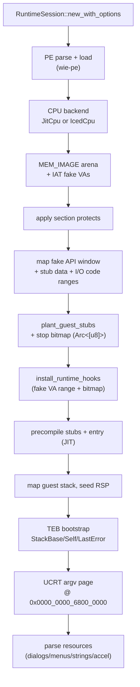
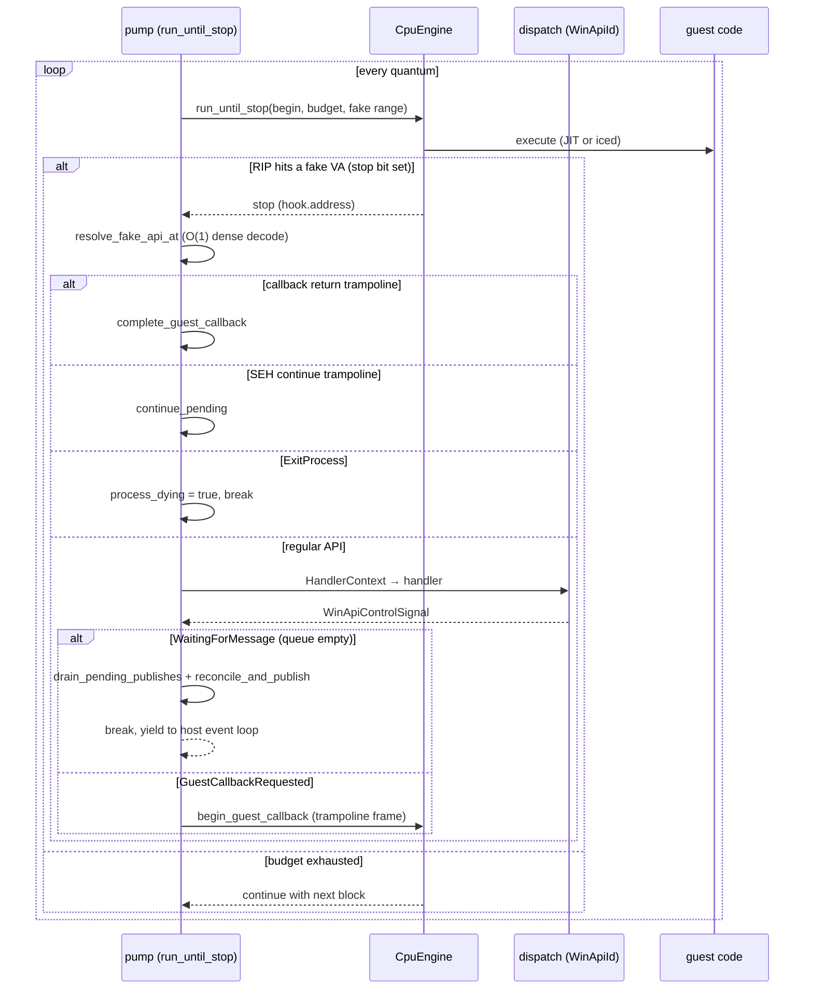
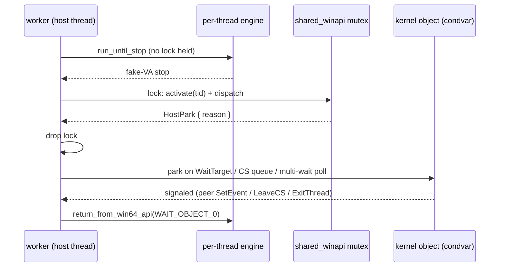

# The runtime session (`wie-runtime`)

`RuntimeSession` owns everything between "the PE is loaded" and "the guest exited": the CPU engine, the WinAPI state, the message queue, the guest stubs, and the pump that turns CPU stops into API calls.

## Session creation

Notable fixed guest ranges (`RuntimeMemoryLayout`, `memory.rs`):

| Region | VA | Purpose |
| --- | --- | --- |
| Fake API window | `0x0000_7000_0000_0000` (4 MiB) | fake import targets + trampolines |
| Guest I/O code | `0x0000_7000_0040_1000` | accelerator code |
| Stub data | `0x0000_7000_0040_9000` | metrics, syscolors, cwd blob |
| Clock table | `0x0000_7000_0040_B000` | host-refreshed 6-slot clock |
| Process heap | `0x0000_0001_6000_0000` (512 MiB) | guest heap |
| CRT argv | `0x0000_0000_6800_0000` | argc/argv/command-line page |
| TEB | `wie_cpu::GS_BASE` | last-error slot etc. |

## The run loop (the pump)

Every API stop pays: decode the fake VA → build a `HandlerContext` → run the handler → `return_from_win64_api`. The hot path stays in guest code via **in-guest stubs** (see below).

## The idle boundary

`WaitingForMessage` fires only when the guest queue is empty — and it runs `drain_pending_publishes()` + `reconcile_and_publish()` before yielding. This is the heartbeat of the GUI: one frame per complete repaint cycle, emitted at a well-defined point. It fires **regardless of callback nesting depth** — a modal dialog's nested `GetMessage` loop runs inside a bridged callback, and skipping the drain there would suppress the dialog's painted frame.

## Guest stubs

Hot APIs never stop the host: the runtime plants x86-64 machine-code bodies into guest memory (`guest_stubs/encode.rs`) that answer directly — `GetLastError` reads a guest slot, `Interlocked*` uses host atomics, clock APIs read the refreshed clock table, and so on. Two deserve a closer look:

- **`DialogBoxParam` runs in-guest.** Its loop calls `GetMessageA` / `IsDialogMessageA` / `DispatchMessageA` — each a fake-VA stop handled by the host — and `EndDialog` writes the result to a **guest memory slot** that the stub reads back when the loop exits.
- **The callback trampoline.** Bridged WndProc calls return to `callback_return_trampoline_va` (`fake_api_base + 0x100`). Hitting it tells the pump to pop the `PendingGuestCallback` stack and return from the outer `DispatchMessageA`.

Stub correctness policy: stubs are planted only when the in-guest body honours the documented API contract — simplified always-success answers that diverge from Microsoft Learn are not used; those APIs stay on the host path.

## Threading model

Guest threads map **1:1 to host threads**, and every guest thread owns a `CpuEngine` that no other thread runs on. `ProcessResources` (`mt_runtime.rs`) holds the primary engine plus the shared backend caches and the WinAPI state; a spawned worker gets its own engine and runs `worker_main`, a loop of activate → pure guest compute → dispatch → park that mirrors the session pump.

### One host thread per guest thread

- The **primary** thread runs on the session host thread; its engine is `ProcessResources.engine`, created at session init.
- A guest `CreateThread` does not spawn anything immediately — the handler records a `PendingSpawn` (`SyncState.pending_spawns`), and `drain_spawns` spawns the host thread at the next pump quantum.
- Each worker host thread is named `wie-guest-{tid}` and runs `worker_main`. JIT workers get `JitCpu::new_shared(Arc<JitShared>)` — the compilation cache is shared, the engine is not; iced workers get `IcedCpu::new_shared` over the shared `Arc<RwLock<GuestMemory>>`. Only WinAPI state sits behind the shared `Arc<Mutex<WinApiState>>`.
- `WIE_MT_DEBUG=1` traces every spawn / park / worker exit (a cached `OnceLock` env check, `mt_debug()`).

### The WinAPI mutex and its scope

The mutex is held only for activate, dispatch, and state mutation — **never across pure `run_until_stop` guest compute**, so worker quanta overlap instead of serializing on one engine. Both loops re-enter it once per quantum:

- The pump activates the primary under the lock before each quantum, drops the lock for `run_until_stop`, and re-locks after the quantum returns to dispatch the stop.
- `worker_main` locks around activate + process-dying check + dispatch, then drops the lock before any host park (`// drop WinAPI lock before host park`).

### The active-TID rule

`ThreadState.active` is process-global: a peer may have activated itself while this thread ran pure guest code without the lock. `activate(tid)` persists the current `GuestThread` into `by_tid` and loads `tid`'s, so every dispatch path must re-activate its own TID under the lock before any handler that reads `current_tid()` — CS ownership, TLS, waits. The pump re-activates the primary before each quantum and again after it returns; `worker_main` re-activates at loop top, at the SEH-continue trampoline, and before every dispatch. Missing re-activation caused false CS ownership and deadlocks under `7za -mmt2` (workers steal `active` while the primary runs pure guest code).

### Parking waits outside the lock

A blocking handler must not hold the WinAPI mutex while waiting: the signaling peer needs that same mutex to mutate state (`SetEvent`, `LeaveCriticalSection`, `ExitThread`), so holding it across the wait deadlocks. A blocking handler therefore returns `WinApiControlSignal::HostPark { reason }`, the loop drops the lock, and `handle_park` (workers) or the pump's `Quantum::Park` arm (primary) executes the wait with **no process lock held**:

- **`WaitObject`** (`WaitForSingleObject`): the park resolves a detached `WaitTarget` — an `Arc` clone of the thread / event / semaphore object — under the lock, then blocks on the object's own condvar. An `INFINITE` wait polls in 50 ms slices and re-checks `process_dying` between slices so teardown can break it; the primary also calls `drain_spawns` inside the loop so workers keep spawning while it is parked.
- **`CriticalSection`**: a contended `EnterCriticalSection` parks on the CS's wait queue — one `CsWaitQueue` per guest CS VA, created on demand in `SyncState.cs_waiters`. `park_brief` yields with exponential backoff (2, 4, 8) then waits 1 ms on the queue condvar; the caller must **retry `EnterCriticalSection`** afterwards, because `Leave` may have notified before the waiter reached the condvar (lost-wakeup safety). The guest retries by re-executing the fake-API stop (the API index is not charged again).
- **`WaitMultiple`**: the handler stashes a `MultiWaitRequest` in `SyncState.multi_wait` keyed by the waiter's TID; the park resolves all handles to targets and polls with ≤ 25 ms slices (5 ms for wait-all, which must not consume auto-reset units before every target is ready).
- **`PthreadWait`**: parked inside the handler through the pthread `WakeQueue`; the park just sleeps 1 ms so the next handler re-entry can re-check the condition.

Waking works because the waiter holds nothing: `SetEvent` / `ReleaseSemaphore` / `LeaveCriticalSection` / `ExitThread` / `thread.finish` notify the relevant condvar, the parked thread wakes, and `return_from_win64_api` writes `WAIT_OBJECT_0` (or `WAIT_TIMEOUT`) into the guest RAX.

### TLS

TLS indices are process-wide (`ThreadState.tls_index_count`, `TlsAlloc`); values live per thread in `GuestThread.tls_values`. `activate(tid)` swaps the active thread's value vector into place (growing it to the process count), so `TlsGetValue`/`TlsSetValue` handlers read `active.tls_values[index]`. TEB last-error is still mirrored at the fixed low VA for the primary thread.

### Stacks

- Guest worker stack: **1 MiB** when `CreateThread`'s `dwStackSize == 0` (Windows-like default).
- Host worker threads: **8 MiB** (`drain_spawns`), so JIT/iced dispatch does not overflow the ~512 KiB secondary-thread default.

### Teardown

`join_workers` takes the mutex, sets `process_dying`, notifies every CS wait queue, sets every event, wakes every semaphore, and marks unfinished thread objects finished — then joins the worker handles. Workers check `process_dying` at every activation and dispatch and exit via `finish_tid`. A worker's normal end is detected by its completion path, not by the join: the pthread-return trampoline (or a `ret` to RIP 0) marks the `ThreadObject` finished and wakes joiners, so `WaitForSingleObject(thread_handle)` returns `WAIT_OBJECT_0`.

### What works

`CreateThread`/`ExitThread` + joins, `_beginthreadex`/`_endthreadex`, `CREATE_SUSPENDED` + `ResumeThread`, critical sections (reenter + contended park), events/semaphores/`WaitForMultipleObjects` (any/all), `Interlocked*` (host atomics), TLS.

## Cross-thread handles

`GuestHandle` is the cloneable, cross-thread window into a session: `window_at` (full-hierarchy hit-test), `post_message`, `take_frame`, the wake callback, menu-tree cache. Posting locks **only the message queue**, never the big WinAPI mutex — the guest thread blocks on API state, not on the host posting to it. A waiting guest wakes immediately (condvar + `triggered` atomic), not on a poll tick.

## Invariants and gotchas

- **Stop-bit coverage**: every fake VA must have its stop bit set before `install_runtime_hooks` — a missing bit means the CPU executes garbage.
- **Soft-translate only**: guest VA ≠ host VA everywhere; `mprotect` supplements but never replaces the software oracle.
- **`ExitProcess` is special-cased** in the pump (`pump.rs:421`): it sets `process_dying` and breaks, instead of running a handler. CRT exit paths (`exit`/`_exit`/`abort`) are treated identically via traits.
- **Dynamic imports**: the import resolver is a closure capturing the soft table (`init.rs:964`) — late-bound DLLs grow the soft table at runtime.
- **`.pdata` feeds SEH**: `RtlLookupFunctionEntry` uses the registered `.pdata` table to find unwind info by RIP — without it, hardware faults (divide-by-zero) have no handler to dispatch to.
- **The `CreateDialogParam` 5th-arg slot** lives at `[rsp+0x90]` relative to the caller's entry RSP (stub prologue + caller stack arg) — a one-off stack offset convention, pinned by a unit test (`e4f020a`).
